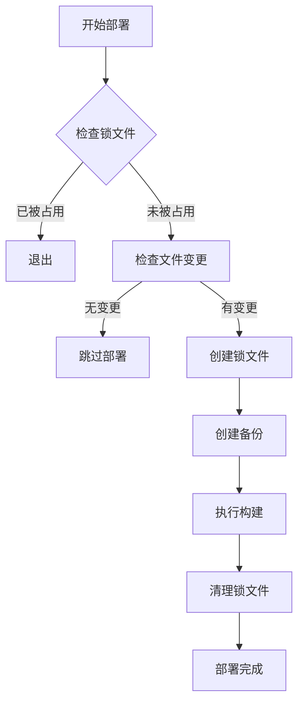

# 前端部署脚本

这是一个专门用于前端项目部署的脚本，具有以下核心功能：

## 核心功能

1. **文件变更监控** - 仅在指定文件发生变更时才触发构建
2. **并发控制** - 防止多个构建进程同时运行
3. **自动备份** - 在执行构建前自动备份项目文件
4. **构建执行** - 执行指定的构建命令

## 使用方法

### 基本语法

```bash
./web_deploy.sh [选项]
```

### 参数说明

| 参数 | 说明 | 是否必须 | 默认值 |
|------|------|---------|--------|
| `-h` | 显示帮助信息 | 否 | - |
| `-v` | 详细模式，显示更多信息 | 否 | 关闭 |
| `-t <project_dir>` | 项目目录 | 是 | - |
| `-c <build_command>` | 构建命令 | 否 | `npm run build` |
| `-w <watch_file>` | 监控文件 | 是 | - |
| `-b <backup_dir>` | 备份目录 | 否 | `<project_dir>/backups` |
| `-l <lock_file>` | 锁文件 | 否 | `<project_dir>/deploy.lock` |
| `-n <max_backups>` | 最大备份数量 | 否 | `5` |

### 使用示例

1. **基本使用**：
```bash
./web_deploy.sh -t /path/to/project -w package.json
```

2. **指定构建命令**：
```bash
./web_deploy.sh -t /path/to/project -w src/config.js -c "npm run build:h5"
```

3. **详细模式**：
```bash
./web_deploy.sh -v -t /path/to/project -w package.json
```

## 工作原理

### 1. 文件变更检测
脚本通过计算监控文件的 MD5 哈希值来检测文件是否发生变化。只有当文件内容发生变化时才会触发后续操作。

### 2. 并发控制
使用锁文件机制防止多个部署进程同时运行：
- 检查锁文件是否存在
- 如果存在且对应进程仍在运行，则拒绝启动新实例
- 脚本正常退出或异常终止时会自动清理锁文件

### 3. 自动备份
在执行构建前会自动创建项目备份：
- 备份文件存储在指定的备份目录中
- 每个备份都有时间戳标识
- 自动清理旧备份，只保留指定数量的最新备份

### 4. 构建执行
切换到项目目录并执行指定的构建命令。

## 部署流程



## 注意事项

1. 脚本使用 `set -euo pipefail` 选项，遇到错误会立即退出
2. 备份时会复制项目目录下的所有文件
3. 默认保留最近5个备份，可通过 `-n` 参数调整
4. 构建命令在项目目录中执行
5. 脚本适用于 Linux 和 macOS 系统